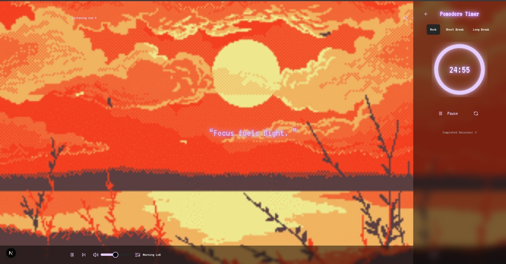

# FocusFlow System v1.9.8.4

A retro-futuristic, terminal-themed Lofi music player combined with a Pomodoro timer and AI-generated focus quotes to create the ultimate productivity and relaxation soundscape.


## ✨ Features

* **🎶 Lofi Music Radio:** Cycles through multiple ambient and Lofi music stations powered by YouTube streams.
* **🎬 Immersive Visuals:** Features animated GIF backgrounds that change with each music station to match the vibe.
* **📟 Retro Terminal UI:** A unique boot-up sequence and hacker-themed aesthetic for a nostalgic feel.
* **🍅 Integrated Pomodoro Timer:** A fully functional Pomodoro timer with customizable work, short break, and long break sessions to boost your productivity.
* **🤖 AI-Powered Quotes:** At the end of each work session, receive a unique, AI-generated quote to keep you motivated.
* **🎧 Minimalist Controls:** Clean and simple controls for play/pause, next track, and volume adjustment.
* **📊 Pomodoro Progress Bar:** A subtle progress bar at the top of the screen shows your current session's remaining time.

---

## 🛠️ Tech Stack

* **Framework:** [Next.js](https://nextjs.org/) (App Router)
* **Language:** [TypeScript](https://www.typescriptlang.org/)
* **Styling:** [Tailwind CSS](https://tailwindcss.com/)
* **UI Components:** [shadcn/ui](https://ui.shadcn.com/)
* **Icons:** [Lucide React](https://lucide.dev/)
* **Music Backend:** [react-youtube](https://github.com/tjallingt/react-youtube)
* **AI Integration:** Serverless function (e.g., Vercel Functions) calling an AI model like Gemini for quote generation.

---

## 🚀 Getting Started

Follow these instructions to get a copy of the project up and running on your local machine.

### Prerequisites

* Node.js (v18.0 or later)
* npm, yarn, or pnpm

### Installation

1.  **Clone the repository:**
    ```bash
    git clone [https://github.com/your-username/focusflow-system.git](https://github.com/your-username/focusflow-system.git)
    cd focusflow-system
    ```

2.  **Install dependencies:**
    ```bash
    npm install
    # or
    yarn install
    # or
    pnpm install
    ```

3.  **Set up environment variables:**
    The project uses an AI model to generate quotes. Create a `.env.local` file in the root directory and add your API key.
    ```env
    # Example for Google AI / Gemini
    GEMINI_API_KEY="YOUR_API_KEY_HERE"
    ```

4.  **Run the development server:**
    ```bash
    npm run dev
    ```
    Open [http://localhost:3000](http://localhost:3000) with your browser to see the result.

---

## 🏗️ Project Structure

The application is structured into several key components to ensure modularity and readability.

* `components/`: Contains all reusable React components.
    * `PomodoroTimer.tsx`: The main Pomodoro timer interface modal.
    * `PomodoroProgress.tsx`: The slim progress bar displayed at the top.
    * `MusicPlayer.tsx`: The fixed music control bar at the bottom.
    * `FocusQuote.tsx`: The component that displays the AI-generated quotes.
    * `TerminalLoader.tsx`: The initial boot-up sequence animation.
* `app/page.tsx`: The main entry point and page for the application, where all components are assembled and state is managed.
* `ai/quote-flow.ts`: Contains the logic for interacting with the AI model to fetch focus quotes.
* `lib/utils.ts`: Utility functions, including the `cn` function from `shadcn/ui` for merging Tailwind CSS classes.

---

## ⚙️ How It Works

* **Music Playback:** The application uses the `react-youtube` library to embed an invisible YouTube player. It plays audio from a predefined list of YouTube video IDs, effectively turning them into radio stations. State is managed with `useState` and `useRef` to control playback and volume.
* **Pomodoro Logic:** The timer is built using `useState` and `useEffect` hooks. A `setInterval` function decrements the `timeLeft` state when the timer is active. When time reaches zero, an alert is triggered, and the timer mode automatically switches (e.g., from 'work' to 'shortBreak').
* **AI Quote Generation:** When a 'work' session ends, the `handleTimerCompletion` function calls the `getFocusQuote` server action. This action securely calls the AI API on the backend, generates a unique quote, and returns it to the client to be displayed in an alert dialog.